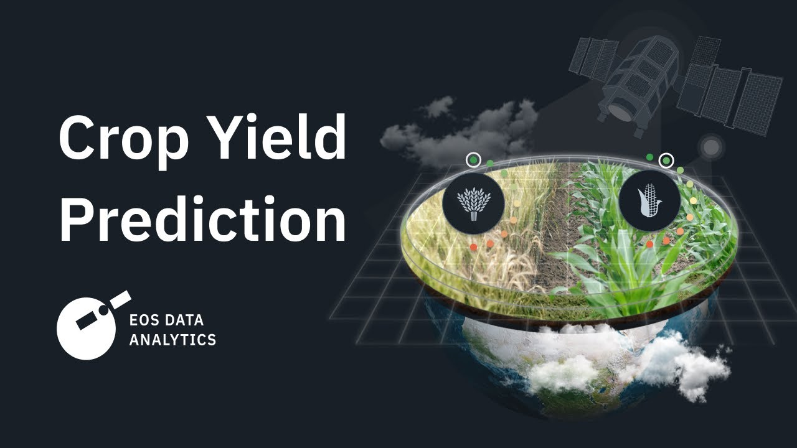

# 🌾 Advanced Crop Yield Prediction System

[](https://python.org)
[](https://streamlit.io)
[](https://scikit-learn.org)
[](LICENSE)

> An AI-powered agricultural analytics platform combining **Machine Learning**, **Data Visualization**, and **Gemini AI** to help farmers, researchers, and agricultural professionals predict crop yields and make data-driven farming decisions.



---

## 📋 Table of Contents

- [Overview](#-overview)
- [Features](#-features)
- [Tech Stack](#-tech-stack)
- [Installation](#-installation)
- [Usage](#-usage)
- [Project Structure](#-project-structure)
- [Machine Learning Models](#-machine-learning-models)
- [API Integration](#-api-integration)
- [Contributing](#-contributing)
- [License](#-license)

---

## 🔍 Overview

The **Advanced Crop Yield Prediction System** addresses key challenges in modern agriculture:

- 📉 **Unpredictable yields** due to changing climate patterns
- 📊 **Data overload** from various agricultural sources
- 🤔 **Decision complexity** in crop selection and resource allocation
- 🌍 **Food security** concerns requiring better planning

This platform transforms raw agricultural data into actionable insights through interactive visualizations, ML predictions, and AI-powered recommendations.

---

## ✨ Features

### 📊 Data Analytics Module

| Feature | Description |
|---------|-------------|
| **Data Exploration** | Interactive analysis of agricultural datasets with filtering and sorting |
| **Feature Analysis** | Correlation analysis between environmental factors and crop yields |
| **Statistical Reports** | Generate comprehensive reports on crop performance metrics |
| **Data Visualization** | Charts, heatmaps, and distribution plots using Plotly & Seaborn |

### 🤖 Machine Learning Module

| Feature | Description |
|---------|-------------|
| **Model Training** | Train custom ML models on your agricultural data |
| **Yield Prediction** | Predict crop yields based on environmental factors |
| **Multi-Model Support** | Random Forest, XGBoost, LightGBM, Linear Regression |
| **Performance Metrics** | Track R², RMSE, MAE across different models |
| **Model Comparison** | Side-by-side comparison of model predictions |

### 📚 Crop Encyclopedia

| Feature | Description |
|---------|-------------|
| **Crop Database** | Detailed information on various crops |
| **Growing Conditions** | Optimal temperature, rainfall, soil requirements |
| **Nutritional Data** | Nutritional profiles for agricultural produce |
| **Pest & Disease Info** | Common issues and prevention methods |

### 🧠 AI Assistant (Gemini Integration)

| Feature | Description |
|---------|-------------|
| **Natural Language Q&A** | Ask agricultural questions in plain English |
| **Image Analysis** | Upload crop images for health assessment |
| **Disease Identification** | AI-powered disease detection from images |
| **Personalized Recommendations** | Context-aware farming advice |

---

## 🛠️ Tech Stack

| Category | Technologies |
|----------|--------------|
| **Frontend** | Streamlit, Plotly, Matplotlib, Seaborn |
| **Backend** | Python 3.9+, Flask |
| **Machine Learning** | Scikit-learn, XGBoost, LightGBM |
| **AI/LLM** | Google Gemini API |
| **Data Processing** | Pandas, NumPy, StatsModels |
| **Visualization** | Plotly, Matplotlib, Seaborn |
| **Reports** | ReportLab (PDF generation) |

---

## 🚀 Installation

### Prerequisites

- Python 3.9 or higher
- pip package manager
- Google Gemini API key (for AI features)

### Quick Start

```bash
# Clone the repository
git clone https://github.com/0011Ashwin/Advanced-Crop-Yield-Prediction-System.git
cd Advanced-Crop-Yield-Prediction-System

# Create virtual environment
python -m venv venv
source venv/bin/activate  # Windows: venv\Scripts\activate

# Install dependencies
pip install -r requirements.txt

# Run the application
streamlit run app.py
```

The app will open at `http://localhost:8501`

---

## 💻 Usage

### 1. Data Exploration
- Navigate to **Data Exploration** tab
- Upload your agricultural CSV data or use built-in datasets
- Apply filters and explore data distributions

### 2. Feature Analysis
- Analyze correlations between variables
- Identify key factors affecting crop yields
- Generate feature importance reports

### 3. Model Training
- Select features and target variable
- Choose from multiple ML algorithms
- Train and evaluate models with cross-validation

### 4. Yield Prediction
- Input environmental parameters
- Select trained model
- Get yield predictions with confidence intervals

### 5. AI Assistant
- Enter your Gemini API key
- Ask questions or upload crop images
- Receive AI-powered insights and recommendations

---

## 📁 Project Structure

```
Advanced-Crop-Yield-Prediction-System/
├── app.py                          # Main Streamlit application
├── requirements.txt                # Python dependencies
├── runtime.txt                     # Python version specification
│
├── src/
│   ├── __init__.py
│   ├── components/                 # UI Components
│   │   ├── data_exploration.py     # Data exploration module
│   │   ├── feature_analysis.py     # Feature analysis module
│   │   ├── model_training.py       # ML model training
│   │   ├── yield_prediction.py     # Prediction interface
│   │   ├── crop_information.py     # Crop encyclopedia
│   │   └── gemini_ai.py            # Gemini AI integration
│   │
│   ├── data/                       # Data utilities
│   ├── models/                     # ML model utilities
│   ├── utils/                      # Helper functions
│   │   └── config.py               # Configuration settings
│   └── visualizations/             # Visualization utilities
│
├── data/                           # Datasets
│   ├── crop_info.json              # Crop information database
│   ├── Crop_recommendation.csv     # Crop recommendation data
│   ├── pesticides.csv              # Pesticide usage data
│   ├── rainfall.csv                # Historical rainfall data
│   ├── temp.csv                    # Temperature data
│   ├── yield_df.csv                # Crop yield dataset
│   └── yield.csv                   # Additional yield data
│
├── models/                         # Saved ML models
│   └── model_metrics.json          # Model performance metrics
│
├── Notebook/                       # Jupyter notebooks
│   └── Test.ipynb                  # Experimentation notebook
│
└── static/
    └── images/                     # Static assets
```

---

## 🤖 Machine Learning Models

### Supported Algorithms

| Model | Use Case | Strengths |
|-------|----------|-----------|
| **Random Forest** | General prediction | Handles non-linear relationships, feature importance |
| **XGBoost** | High accuracy | Gradient boosting, handles missing data |
| **LightGBM** | Large datasets | Fast training, memory efficient |
| **Linear Regression** | Baseline model | Interpretable, quick training |

### Model Pipeline

```
Data Input → Preprocessing → Feature Engineering → Model Training → Evaluation → Prediction
     ↓            ↓               ↓                    ↓              ↓
  CSV/API    Cleaning,       Correlation,          Cross-val,     R², RMSE,
             Encoding        Selection             Grid Search    MAE
```

### Key Features Used

- **Climate**: Temperature, Rainfall, Humidity
- **Soil**: pH, Nitrogen, Phosphorus, Potassium
- **Geography**: Region, Latitude, Longitude
- **Temporal**: Season, Year, Growing Period

---

## 🔑 API Integration

### Google Gemini API

1. Get API key from [Google AI Studio](https://aistudio.google.com/apikey)
2. Enter key in the **Gemini AI** section of the app
3. Enable the following features:
   - Text generation for Q&A
   - Vision API for image analysis

### Data Sources

The system can integrate with:
- CSV files with historical crop data
- Weather APIs for real-time climate data
- Soil quality databases
- Government agricultural datasets

---

## 📊 Sample Predictions

| Crop | Region | Predicted Yield | Confidence |
|------|--------|-----------------|------------|
| Wheat | Punjab | 4.2 tonnes/ha | 92% |
| Rice | Tamil Nadu | 3.8 tonnes/ha | 89% |
| Cotton | Gujarat | 2.1 tonnes/ha | 87% |

---

## 🤝 Contributing

Contributions are welcome! Here's how to get started:

1. **Fork** the repository
2. **Create** a feature branch (`git checkout -b feature/NewAnalysis`)
3. **Commit** your changes (`git commit -m 'Add soil analysis module'`)
4. **Push** to the branch (`git push origin feature/NewAnalysis`)
5. **Open** a Pull Request

### Ideas for Contributions

- [ ] Add more ML algorithms (Neural Networks, SVR)
- [ ] Implement real-time weather API integration
- [ ] Add satellite imagery analysis
- [ ] Create mobile-responsive design
- [ ] Add multi-language support

---

## 📄 License

This project is licensed under the MIT License - see the [LICENSE](LICENSE) file for details.

---

## 🙏 Acknowledgments

- **FAO** for agricultural datasets and guidelines
- **Google** for Gemini AI capabilities
- **Streamlit** for the dashboard framework
- Open-source ML community for algorithms and tools

---

<p align="center">
  Made with ❤️ for sustainable agriculture
  <br>
  <a href="https://github.com/0011Ashwin">@0011Ashwin</a>
</p>
